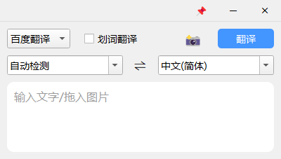
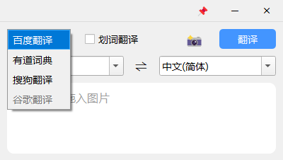
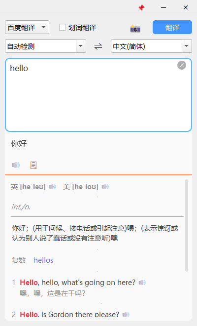
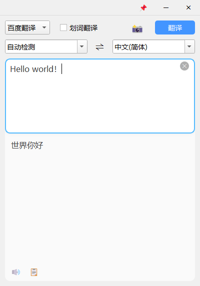
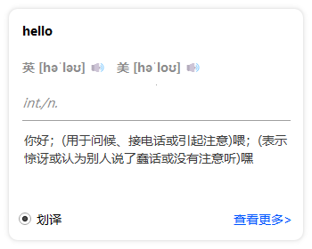

# 基于PyQT5制作的翻译小程序

**通过`httpx`获取翻译结果，使用`PyQT5`设计界面，使用`SystemHotkey`设置全局快捷键**

**1. 实现基本翻译功能**

**2. 实现截图（支持快捷键`F1`启动）或拖入图片进行识别翻译**

**3. 实现伪划词（复制）翻译，悬浮窗方式输出翻译结果**

**4. 支持音标发音，翻译结果播报**

**5. 支持一键复制翻译结果**

**6. 支持百度翻译、有道词典和搜狗翻译**

......


### 环境搭建

- 安装`Python`

推荐安装[👉Python 3.8.10](https://mirrors.huaweicloud.com/python/3.8.10/)

- 安装依赖包

```shell
pip install -r requirements.txt
```


### 程序封装

> 封装`exe`单文件版（启动慢）：

```shell
pyinstaller pyinstaller-single.spec
```


> 封装`exe`便携版（启动快）：

```shell
pyinstaller pyinstaller-portable.spec
```


### 程序界面











### 常见问题

- 解决`Linux`运行程序无法输入中文：

复制文件：`/usr/lib/x86_64-linux-gnu/qt5/plugins/platforminputcontexts/libfcitxplatforminputcontextplugin.so`

到：`site-packages/PyQt5/Qt5/plugins/platforminputcontexts`


- 解决`Linux`运行程序时报错：`Could not load the Qt platform plugin "xcb" in "" even though it was found.`：

```shell
sudo apt-get install libxcb-xinerama0
```

